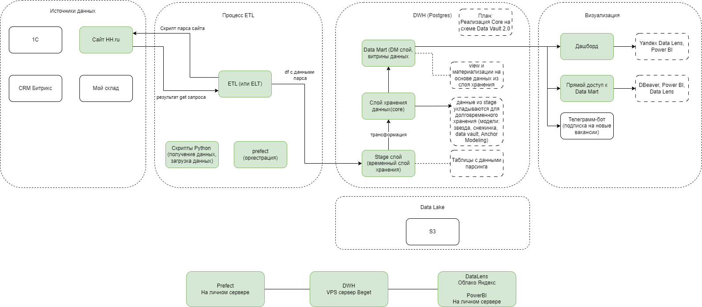

# Анализ вакансий на hh.ru

Данный репозиторий является частью проекта по анализу вакансий с hh.ru.  
Здесь будут размещены данные о дашбордах построенных в проекте.  
Всего таких репозиториев три:
1. pars_hh_ETL https://github.com/kulakov544/pars_hh_ETL.git
2. pars_hh_DWH https://github.com/kulakov544/pars_hh_DWH.git
3. pars_hh_Report https://github.com/kulakov544/pars_hh_report.git

### Бизнес требование
Нужно узнать какие навыки требуются на рынке вакансий.

### Техническое задание
Получить аналитику по требованиям к соискателям вакансий на сайте hh.ru по IT направлению.

### Решение
1. Построить базу DWH на PostgreSQL.
2. Получить данные о вакансиях с сайта hh.ru
3. Провести первичную обработка данных для загрузки в базу.
4. Загрузить данные в Stage слой DWH.
5. Трансформировать данные для укладки на долговременное хранение.
6. Заполнить справочники и таблицу вакансий в Core слое DWH, с сохранением обновленных записей в таблицу истории.
7. Оркестрация процесса через Prefect.
8. Сделать View и материализацию таблиц в DataMart слое DWH
9. По данным из DataMart построить дашборды в Yandex Data Lens и Power BI  

### Power BI
Дашборд призван ответить какие навыки и по каким типам вакансий требуются чаще всего.
Дополнительно добавлены счетчики для понимания количества вакансий выборке. Чем больше 
вакансий тем точнее данные.

  
На второй странице размещена карта с местом нахождения вакансий. Она должна была показать в 
каких городах больше скопление вакансий. А за одно могла позволить выбирать вакансии 
по местонахождению и получать о них информацию. К сожалению вакансий с заполненными данными
о местонахождении крайне мало.

В идеале должна была получиться похожая картина во многих городах и скопления точек разной 
плотности на карте страны.

На третьей странице можно посмотреть топ компаний по количеству вакансий с различными 
параметрами.

Четвертая страница сделана для поиска вакансий по некоторым параметрам. После чего их можно 
отсортировать в одном списке.

  
Файл отчета для PowerBI есть в репозитории. 

